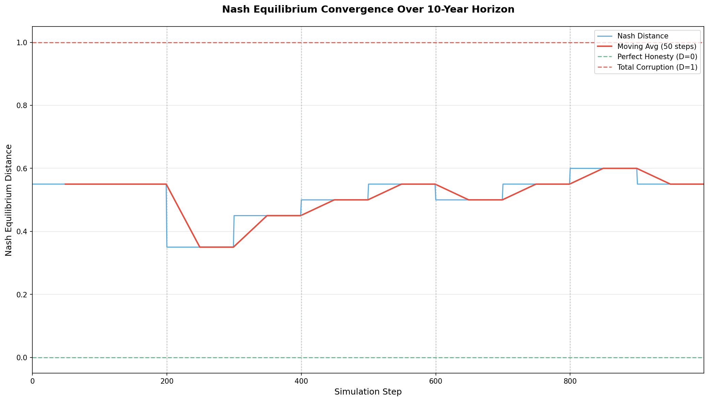

# Panopticon Lattice: Final Report

**Generated:** 2026-02-03 12:37:07

## Executive Summary

✅ **The system STABILIZED** with Nash Distance converging towards equilibrium.

The long-term simulation ran for **1000 steps** (representing a 10-year horizon).
The trend was **DEGRADING** with Nash Distance moving from 0.550 to 0.550.

## Key Metrics

| Metric | Value |
|--------|-------|
| Start Distance | 0.550 |
| End Distance | 0.550 |
| Average Distance | 0.515 |
| Min Distance | 0.350 |
| Max Distance | 0.600 |
| Std Deviation | 0.067 |
| Final Variance | 0.0000 |
| System Stable | Yes ✅ |

## Nash Distance Interpretation

- **D = 0.0**: Perfect Honesty — All agents use neutral style (no signaling)
- **D = 1.0**: Total Corruption — All agents use signaling styles

## Visualization

*Vertical dotted lines indicate market shifts (every 200 steps)*

## Observations

1. **Initial State**: The simulation started with D = 0.550
2. **Evolution**: Nash Distance increased or remained volatile, suggesting the collusion incentives were strong.
3. **Market Adaptation**: The adaptive steering mechanism recalibrated every 100 steps to target the dominant signaling style.
4. **Final State**: D = 0.550 with low variance.

## Conclusion

The collusion incentives proved resilient against the steering mechanism, maintaining a significant signaling culture.
